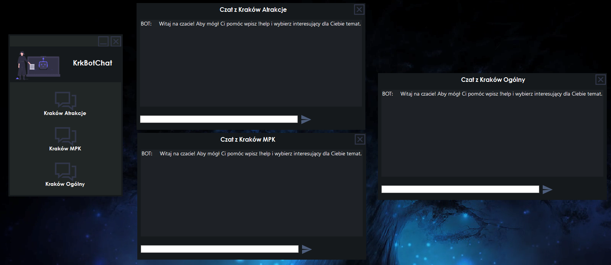

# KrkBotChat

Simple chat app made as my university project. The purpose of the chat is to help the user in three categories while visiting Cracow:
* Attractions
* MPK public transport
* General

## Commands

After opening the selected chat, the user gets access to the !help command which displays all available commands in chat.

<strong>lang:</strong> PL
